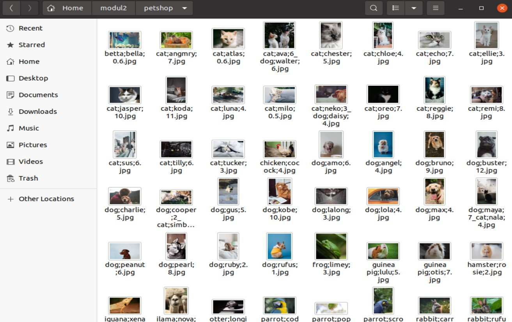
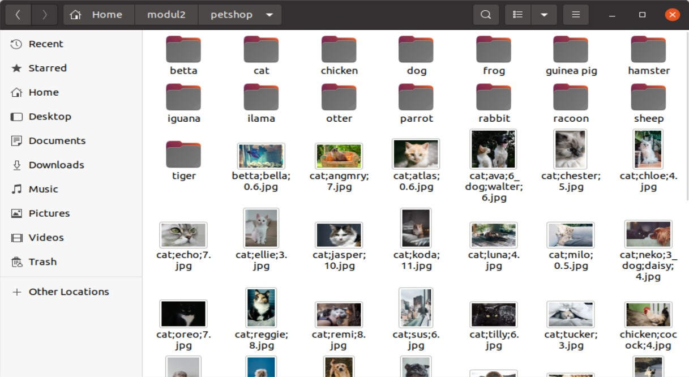
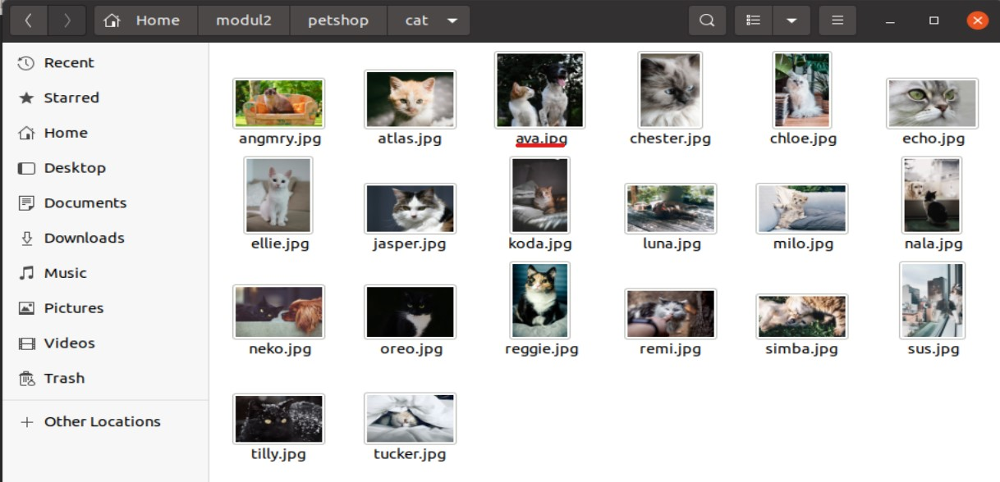
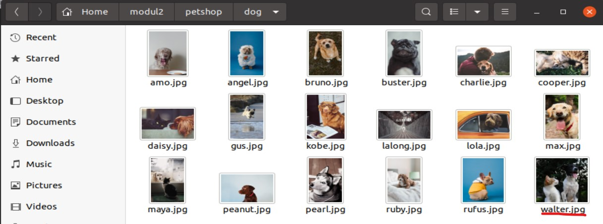
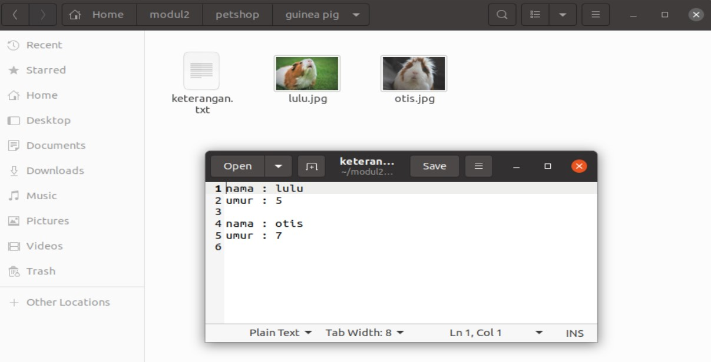
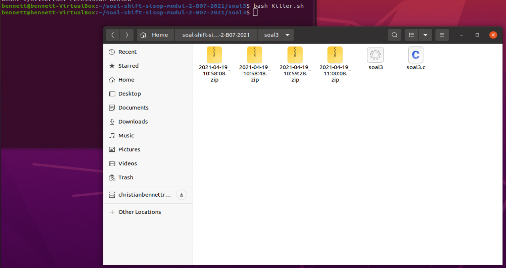

# soal-shift-sisop-modul-2-B07-2021
## Anggota Kelompok
* Christian Bennett Robin 05111940000078
* Zelda Elma Sibuea 05111940000038
* Hanifa Fauziah 05111940000024

## Soal 1
Pada suatu masa, hiduplah seorang Steven yang hidupnya pas-pasan. Steven punya pacar, namun sudah putus sebelum pacaran. Ketika dia galau memikirkan mantan, ia selalu menonton https://www.youtube.com/watch?v=568DH_9CMKI untuk menghilangkan kesedihannya. 

Di lain hal Steven anak yang tidak amat sangat super membenci matkul sisop, beberapa jam setelah diputus oleh pacarnya dia menemukan wanita lain bernama Stevany, namun Stevany berkebalikan dengan Steven karena menyukai sisop. Steven ingin terlihat jago matkul sisop demi menarik perhatian Stevany.

Pada hari ulang tahun Stevany, Steven ingin memberikan Stevany zip berisikan hal-hal yang disukai Stevany. Steven ingin isi zipnya menjadi rapi dengan membuat folder masing-masing sesuai extensi.

### 1A ###
Membuat folder yang bernama Fylm, Musyik, dan Pyoto.
```c
 child_id = fork();
            if (child_id == 0){
                //membuat direktori baru
                char *argv[] = {"mkdir","Fylm","Musyik","Pyoto",NULL};
                execv("/bin/mkdir", argv); 
```
Pada soal, untuk membuat folder maka disini kami menggunakan `fork()` untuk membuat suatu proses yang baru, lalu
pada `char argv[]= {"mkdir","Fylm","Musyik","Pyoto",NULL};` insialisasi untuk membuat foldernya.
Lalu fungsi `execv` untuk menjalankan perintahnya.

### 1B ###
Pada soal ini Steven ingin mendownload file nya dari link yang sudah disediakan.
```c
//mendownload dari link
            }else{
                child_id1 = fork();
                if (child_id1 == 0) {
                    child_id2 = fork();
                    if (child_id2 == 0){
                        char *download[]=  { "wget", "-q","--no-check-certificate","https://drive.google.com/uc?id=1ktjGgDkL0nNpY-vT7rT7O6ZI47Ke9xcp&export=download", "-O","Film_for_Stevany.zip",NULL};
                        execv("/bin/wget", download);
                    }
                    else {
                        while ((wait(&status)) > 0);
                        sleep (10);
                        child_id3 = fork();          
                        if (child_id3 == 0){
                            char *download1[] = { "wget", "-q","--no-check-certificate","https://drive.google.com/uc?id=1ZG8nRBRPquhYXq_sISdsVcXx5VdEgi-J&export=download", "-O","Musik_for_Stevany.zip",NULL};
                            execv("/bin/wget", download1);  
                        }
                        else {
                            while ((wait(&status)) > 0);
                            char *download2[]=  { "wget", "-q","--no-check-certificate","https://drive.google.com/uc?id=1FsrAzb9B5ixooGUs0dGiBr-rC7TS9wTD&export=download", "-O","Foto_for_Stevany.zip",NULL};
                            execv("/bin/wget", download2);
                        }

```
Untuk mendownload file, kami membuatnya di parentnya, karena menunggu proses child terlebih dahulu selesai yaitu membuat folder, lalu mendownload file dari linknya.
Kami membuatnya dalam bebrapa **fork** yaitu pada `child_id1=fork();` merupakan fork pertama untuk proses mendownload. Pada **fork** pertama, kami membuat proses download untuk Film, yang disimpan dalam bentuk **Film_for_Stevany.zip**. Pada `char *download[]` merupakan inisialisasi untuk mendownload. Perintah `wget` merupakan perintah untuk mendownload file dari linknya. Lalu, didalam fork() yang sama, pada parentsnya kami membuat proses baru lagi untuk mendownload Musik, yang disimpan dalam bentuk **Musik_for_Stevany**.

Perintah `while ((wait(&status))>0`, berarti menunggu proses childnya dulu selesai lalu dilanjutkan dengan proses parent yang dibawahnya. Lalu, pada parent terakhir, kami membuat proses download untuk file foto yang disimpan dengan nama **Foto_for_Stevany**. Dan pada setiap perintah dijalankan, perintah `execv` akan menjalankan perintah tersebut.

## Soal 2
Loba bekerja di sebuah petshop terkenal, suatu saat dia mendapatkan zip yang berisi banyak sekali foto peliharaan dan Ia diperintahkan untuk mengkategorikan foto-foto peliharaan tersebut. Loba merasa kesusahan melakukan pekerjaanya secara manual, apalagi ada kemungkinan ia akan diperintahkan untuk melakukan hal yang sama. Kamu adalah teman baik Loba dan Ia meminta bantuanmu untuk membantu pekerjaannya.

### 2A ###
Pertama-tama program perlu mengextract zip yang diberikan ke dalam folder “/home/[user]/modul2/petshop”. Karena bos Loba teledor, dalam zip tersebut bisa berisi folder-folder yang tidak penting, maka program harus bisa membedakan file dan folder sehingga dapat memproses file yang seharusnya dikerjakan dan menghapus folder-folder yang tidak dibutuhkan.

**Fungsi folder2a()**
```c
void folder2a(){
	int status;
	pid_t pid1;
	pid1 = fork();
	if (pid1 < 0){
		exit(EXIT_FAILURE);
   	}
   	if (pid1 == 0) {
    	char *argvA[] = {"mkdir", "-p", "./petshop", NULL};
    	execv("/bin/mkdir", argvA);
   	}
   	while((wait(&status))>0);
	int status2;
   	pid_t unzip_id;
   	unzip_id = fork();
   	if (unzip_id<0){
    	exit(EXIT_FAILURE);
   	}
   	if (unzip_id == 0){
    	char *argvB[] = {"unzip", "/home/hanifa/modul2/pets.zip", "-d", "/home/hanifa/modul2/petshop", "-x", "*/*", NULL};
    	execv("/usr/bin/unzip", argvB);
   	}
	while((wait(&status2))>0);
}
```

Pada soal ini diminta untuk **mengekstrak zip** yaitu `pets.zip`. Di folder **petshop**, dimana yang digunakan hanyalah yang file saja. Untuk membuat folder **petshop** menggunakan perintah `mkdir` dengan diikuti `-p` yang diikuti dengan `./petshop` untuk mengeset nya menjadi parent. 
```c
char *argvA[] = {"mkdir", "-p", "./petshop", NULL};
execv("/bin/mkdir", argvA);
```

Sedangkan untuk melakukan ekstrak pada `pets.zip`, menggunakan perintah `unzip` dengan diikuti *letak dari file `pets.zip`* lalu `-d` dan diikuti _letak tujuan dari file_ yang diekstrak. Karena yang diperlukan hanya yang bertipe file, maka digunakan perintah `x` yang diikuti `*/*` yang berarti mengecualikan yang bertipe folder/direktori.
```c
char *argvB[] = {"unzip", "/home/hanifa/modul2/pets.zip", "-d", "/home/hanifa/modul2/petshop", "-x", "*/*", NULL};
execv("/usr/bin/unzip", argvB);
```

Sehingga ketika kodingan pada fungsi `folder2a()` ini dipanggil dibagian **main**, dapat menghasilkan seperti gambar berikut ini.




### 2B ###
Foto peliharaan perlu dikategorikan sesuai jenis peliharaan, maka kamu harus membuat folder untuk setiap jenis peliharaan yang ada dalam zip. Karena kamu tidak mungkin memeriksa satu-persatu, maka program harus membuatkan folder-folder yang dibutuhkan sesuai dengan isi zip.
Contoh: Jenis peliharaan kucing akan disimpan dalam “/petshop/cat”, jenis peliharaan kura-kura akan disimpan dalam “/petshop/turtle”.

**Fungsi folder2b()**
```c
void folder2b(){
	int status3;
	DIR *d;
	struct dirent *dir;
	d = opendir("/home/hanifa/modul2/petshop");
    char *delim1 = ";";
    while ((dir = readdir(d)) != NULL) {
    	if ((strcmp(dir->d_name, "..")!=0) && (strcmp(dir->d_name, ".")!=0)){
        	char filename[100] = "";
    		strcpy(filename, dir->d_name);
          	char *name = strtok(filename, delim1);
          	char makefolder[100] = "/home/hanifa/modul2/petshop/";
          	strcat(makefolder, name);
			
	  		pid_t folder_id;
	  		folder_id = fork();
	   		if (folder_id<0){
	      		exit(EXIT_FAILURE);
	    	}
	    	if (folder_id == 0){
	       		char *argvC[] = {"mkdir", "-p", makefolder, NULL};
               	execv("/bin/mkdir", argvC);
	    	}
			while((wait(&status3))>0);
    	}
    }
    closedir(d);
}
```

Melanjutkan bagian 2a, setelah melakukan ekstrak kita diminta untuk **membuat folder-folder** sesuai dengan jenis hewan yang ada difile foto, dimana file-file folder ini akan ditempatkan didalam folder petshop tadi. Jadi disini pada awalnya mengakses folder petshop yang berisi file-file yang telah diekstrak tadi, dengan perintah dibawah ini.

```c
DIR *d;
struct dirent *dir;
d = opendir("/home/hanifa/modul2/petshop");
```
Disini kita akan **membuka directory petshop** untuk dapat **mengakses file yang ada didalamnya**. Menggunakan looping `while ((dir = readdir(d)) != NULL)` untuk bisa mengecek seluruh file yang ada. Lalu diikuti dengan `if ((strcmp(dir->d_name, "..")!=0) && (strcmp(dir->d_name, ".")!=0))` yang merupakan percabangan, dimana menyatakan kondisi dimana yang diproses hanyalah file yang bernama (mengecualikan `.` dan `..`). 
```c
char filename[100] = "";
strcpy(filename, dir->d_name);
char *name = strtok(filename, delim1);
char makefolder[100] = "/home/hanifa/modul2/petshop/";
strcat(makefolder, name);
pid_t folder_id;
folder_id = fork();
if (folder_id<0){
    exit(EXIT_FAILURE);
}
if (folder_id == 0){
    char *argvC[] = {"mkdir", "-p", makefolder, NULL};
    execv("/bin/mkdir", argvC);
}
while((wait(&status3))>0);
```
Lalu didalam percabangan ini pertama-tama kita menyimpan nama dari file yang bisa didapatkan melalui perintah `(dir->d_name)` ke variabel **filename** yang bertipe _char_ dengan menggunakan fungsi `strcpy()`. Setelah itu melakukan split pada **filename** dengan menggunakan fungsi `strtok()` dimana potongan dari filename yang didapatkan ialah jenis dari hewan yang ada di file foto tersebut, dimana jenisnya ini disimpan di variabel **name** yang bertipe `char`. Lalu jenis dari hewan ini akan digabung dengan bantuan fungsi `strcat()` dengan path dimana folder _petshop_ berada yaitu `/home/hanifa/modul2/petshop/`. Dimana path ke folder jenis hewan ini disimpan pada variabel **makefolder** yang bertipe `char`. Setelah itu barulah dipanggil command `mkdir` untuk membuat folder.
Pada akhir fungsi folder2b() ini, dimana ketika semua file yang ada telah diakses, terdapat fungsi `closedir()` yang berguna untuk menutup akses kepada directory petshop yang telah kita proses tadi.

Ketika kodingan pada fungsi `folder2a()` dan `folder2b` ini dipanggil sekaligus dibagian **main**, dapat menghasilkan seperti gambar berikut ini.



### 2 C, D, E ###
#### 2C ####
Setelah folder kategori berhasil dibuat, programmu akan memindahkan foto ke folder dengan kategori yang sesuai dan di rename dengan nama peliharaan.
Contoh: “/petshop/cat/joni.jpg”.

#### 2D ####
Karena dalam satu foto bisa terdapat lebih dari satu peliharaan maka foto harus di pindah ke masing-masing kategori yang sesuai. Contoh: foto dengan nama “dog;baro;1_cat;joni;2.jpg” dipindah ke folder “/petshop/cat/joni.jpg” dan “/petshop/dog/baro.jpg”.

#### 2E ####
Di setiap folder buatlah sebuah file "keterangan.txt" yang berisi nama dan umur semua peliharaan dalam folder tersebut. Format harus sesuai contohnya.

```c
void move2c(){
	int status5;
	DIR *d;
    struct dirent *dir;
    d = opendir("/home/hanifa/modul2/petshop");
    char *delim1 = ";";
	char *delim2 = "_";
	while ((dir = readdir(d)) != NULL) {
		if ((dir->d_type != DT_DIR) && (strcmp(dir->d_name, "..")!=0) && (strcmp(dir->d_name, ".")!=0)){
			char filename[300] = "";
    		strcpy(filename, dir->d_name);
	  		char asal[300] = "/home/hanifa/modul2/petshop/";	  
   	  		strcat(asal, filename);
   	  			
   	  		filename[strlen(filename)-4]='\0'; //hapus .jpg
   	  			
   	  		char *animal1 = strtok(filename, delim2);
   	  		char *animal2 = strtok(NULL, delim2);
   	  		
			if (animal2 != NULL ){ //kalau ada hewan ke-2
				detail(asal, animal2);
			}
			
			detail(asal, animal1);
			
			
			pid_t delete_id;
			delete_id = fork();
			if (delete_id<0){
				exit(EXIT_FAILURE);
			}
			if (delete_id == 0){
				char *argvE[] = {"rm", asal, NULL};
				execv("/bin/rm", argvE);
			}
			while((wait(&status5))>0);
       	}
    }
    closedir(d);
}
```
Pada nomor 2c dan d, diminta untuk **memindahkan file** ke directory jenis yang telah dibuat sebelumnya. Dimana selain memindahkan, juga disuruh untuk **mengubah nama dari file**, menjadi `namahewannya.jpg`. Dimana untuk file yang memiliki 2 hewan di foto & namanya, yang dipisahkan oleh tanda `_`, file foto nya harus dipindahkan ke masing-masing folder jenis hewannya dengan mengubah namanya juga.

```c
int status5;
DIR *d;
struct dirent *dir;
d = opendir("/home/hanifa/modul2/petshop");
char *delim1 = ";";
char *delim2 = "_";
while ((dir = readdir(d)) != NULL) {
	if ((dir->d_type != DT_DIR) && (strcmp(dir->d_name, "..")!=0) && (strcmp(dir->d_name, ".")!=0)){
```
Sama seperti nomor 2b, pada fungsi `move3c()` ini hal awal yang dilakukan ialah membuka dan mengakses directory petshop yang merupakan tempat file-file dan juga directory jenis hewan berada. Disini menggunakan percabangan `if` lagi, yang ditambahkan dengan kondisi `dir->d_type != DT_DIR` dimana yang kita proses dalam pemindahan hanyalah file yang ada saja (mengecualikan folder yang ada). 

```c
char filename[300] = "";
strcpy(filename, dir->d_name);
char asal[300] = "/home/hanifa/modul2/petshop/";	  
strcat(asal, filename);			
filename[strlen(filename)-4]='\0'; //hapus .jpg
```
Sama seperti sebelumnya, yaitu menyimpan nama dari file ke variabel `filename` yang bertipe _char_. Setelah itu, membuat variabel **asal** yang dimana disini nantinya akan disimpan path ke file yang sekarang. Lalu, pada **filename** yang berisikan nama dari file, awalnya namanya memiliki struktur `jenis;nama;umur.jpg` ataupun `jenis1;nama1;umur1_jenis2;nama2;umur2.jpg` untuk memudahkan dalam melakukan pemisahan untuk mendapatkan jenishewan, namahewan, dan juga umurnya. Maka tulisan `.jpg` dihapus dengan menggunakan perintah `filename[strlen(filename)-4]='\0';`

```c
char *animal1 = strtok(filename, delim2);
char *animal2 = strtok(NULL, delim2);
if (animal2 != NULL ){ //kalau ada hewan ke-2
	detail(asal, animal2);
}
detail(asal, animal1);
```
Setelah menghapus tulisan `.jpg`nya, maka kita bisa mulai melakukan pemisahan pada filename nya untuk mendapatkan potongan kata yang diinginkan. Pada pemisahan ini, hal pertama yang dilakukan ialah melakukan pemisahan antara hewan 1 (disebelah kiri) dengan hewan 2 (disebelah kanan), pemisahan ini dilakukan dengan bantuan fungsi `strtok()`, hasil dari fungsi `strtok(filename, delim2)` dengan delim2nya `_` ialah `jenis;nama;umur` hewan 1, dan untuk fungsi `strtok(NULL, delim2)` akan mengambil `jenis;nama;umur` hewan 2.Setelah itu, memberi kondisi percabangan, dimana apabila terdapat hewan 2, maka akan menjalankan fungsi `detail()` yang memiliki parameter path **asal** dan **animal2** yang berisikan `jenis;nama;umur` hewan 2. Setelah selesai, maka akan lanjut dengan menjalankan fungsi `detail()` selanjutnya yang memiliki parameter path **asal** dan **animal1**. 

```c
void detail(char *asalnya, char *hewan){
	int status4;
	char *delim1 = ";";
	char *jenis = strtok(hewan, delim1);
	char *nama = strtok(NULL, delim1);
	char *umur = strtok(NULL, delim1);
		
	char ket_path[300];
	sprintf(ket_path, "/home/hanifa/modul2/petshop/%s/keterangan.txt", jenis);
	
	char newname[300];
	sprintf(newname, "/home/hanifa/modul2/petshop/%s/%s.jpg", jenis, nama);
	
	char isinya[300];
	sprintf(isinya, "nama : %s \numur : %s\n\n", nama, umur);
	
	;
	pid_t move_id;
	move_id = fork();
	if (move_id<0){
		exit(EXIT_FAILURE);
	}
	if (move_id == 0){
		char *argvD[] = {"cp", asalnya, newname, NULL};
		execv("/bin/cp", argvD);
	}
	while((wait(&status4))>0);

	FILE *keterangan;
	keterangan = fopen(ket_path, "a"); //agar bisa membuka dan menulis txt
	if(keterangan){
		fprintf(keterangan, "%s", isinya);
		fclose(keterangan);
	}
}
```
Pada fungsi `detail()` pertama-tama dilakukan pemisahan `jenis;nama;umur` pada variabel **hewan** yang ada lalu disimpan ke masing-masing variabel **nama**, **jenis**, dan **umur**. Dimana pemisahan ini dibantu dengan fungsi `strtok()` dengan parameter **hewan** (jenis;nama;umur) dan delimiternya yaitu `;` (delim1). 

Selain melakukan pemindahan dan rename, pada fungsi `detail()` juga dilakukan penulisan seluruh nama dan umur hewan di folder jenis hewan yang sama ke file `keterangan.txt` sesuai dengan perintah nomor 2e.

```c
int status4;
char *delim1 = ";";
char *jenis = strtok(hewan, delim1);
char *nama = strtok(NULL, delim1);
char *umur = strtok(NULL, delim1);
		
char newname[300];
sprintf(newname, "/home/hanifa/modul2/petshop/%s/%s.jpg", jenis, nama);
```
Agar dapat melakukan pengubahan nama file sekaligus perpindahan ke folder jenis yang dituju, maka dibuatlah variabel bertipe char yang bernama `newname` yang berisikan path kefolder yang dituju, dimana pada path ini ditambahkan `nama` dari hewan yang diakhiri dengan `.jpg`.

```c
char ket_path[300];
sprintf(ket_path, "/home/hanifa/modul2/petshop/%s/keterangan.txt", jenis);

char isinya[300];
sprintf(isinya, "nama : %s \numur : %s\n\n", nama, umur);
```
Dalam membantu penulisan nama dan umur hewan ke file `keterangan.txt` maka dibuatlah variabel **ket_path** yang berisikan path ke file keterangan.txt yang berada dimasing-masing folder jenis hewan. Selain itu, dibuat variabel **isinya** yang berisi string berupa nama dan umur dari hewan yang ada di file foto, untuk memudahkan kita dalam penulisan kedalam file `keterangan.txt`.

```c
char *argvD[] = {"cp", asalnya, newname, NULL};
execv("/bin/cp", argvD);
```
Setelah mendapatkan variabel **newname** tadi, maka bisa dilakukan pemindahan file dimana disini file hanya akan disalin, agar memudahkan pemindahan ketika pada file terdapat 2 hewan. Dalam melakukan penyalinan file ini, digunakan perintah `cp` yang diikuti dengan path asal dari file dan path baru yang sekaligus merupakan nama baru dari file. 

Hasil dari perpindahan bisa dilihat pada gambar berikut ini.




```c
FILE *keterangan;
keterangan = fopen(ket_path, "a"); //agar bisa membuka dan menulis txt
if(keterangan){
	fprintf(keterangan, "%s", isinya);
	fclose(keterangan);
}
```
Setelah melakukan perpindahan pada file, maka bisa dilakukan penulisan nama dan umur hewan pada file `keterangan.txt` yang ada di masing-masing folder. Awalnya, file yang telah dibuat dengan bantuan variabel **ket_path** tadi dibuka dengan diikuti perintah `a` yang artinya file bisa dibuka dan ditulis txt. Lalu, didalam file ini ditulislah nama dan umur dari hewan yang tadinya berada pada variabel **isinya** dengan bantuan perintah `fprintf()`. Setelah menulis, maka file bisa ditutup dengan bantuan perintah `fclose()`.

```c
char *argvE[] = {"rm", asal, NULL};
execv("/bin/rm", argvE);
}
```
Kembali ke fungsi `move2c` dimana setelah semua file sudah sirename dan dipindahkan ke folder yang sesuai dan juga telah dilakukan penulisan pada `keterangan.txt` nya masing-masing, maka dapat dilakukan penghapusan pada file yang ada ditempat awal, dimana hal ini dibantu dengan perintah `rm` yang diikuti letak file asal.

Jika semua fungsinya dijalankan maka akan dapat file keterangan.txt yang sudah berisi. Berikut ini contohnya.




## Soal 3

### 3A ###

Ranora harus membuat sebuah program C yang dimana setiap 40 detik membuat sebuah direktori dengan nama sesuai timestamp [YYYY-mm-dd_HH:ii:ss].

```c
while (1)
    {
        //untuk mendapatkan waktu saat program dieksekusi
        time_t rawtime;
        struct tm *timeinfo;
        char stringTime[sizeof "YYYY-MM-DD_HH:MM:SS"];
        time(&rawtime);
        timeinfo = localtime(&rawtime);
        strftime(stringTime, sizeof(stringTime), "%Y-%m-%d_%X", timeinfo);

        if (fork() == 0)
        {
            //membuat direktori baru dengan nama waktu yang telah ditentukan
            char *argv[] = {"mkdir", stringTime, NULL};
            execv("/bin/mkdir", argv);
        }
        ...
     }
```
Pertama-tama kami mendapatkan waktu dengan menggunakan `time_t` lalu kami membuat string `stringTime` yang berisi waktu yang telah kami cari. String tersebut dapat berisi waktu dari `time_t` dengan menggunakan fungsi `strftime`.

Setelah itu kami melakukan fork proses baru untuk membuat direktori baru menggunakan
```c
char *argv[] = {"mkdir", stringTime, NULL};
            execv("/bin/mkdir", argv);
```


### 3B ###

Setiap direktori yang sudah dibuat diisi dengan 10 gambar yang didownload dari https://picsum.photos/, dimana setiap gambar akan didownload setiap 5 detik. Setiap gambar yang didownload akan diberi nama dengan format timestamp [YYYY-mm-dd_HH:ii:ss] dan gambar tersebut berbentuk persegi dengan ukuran (n%1000) + 50 pixel dimana n adalah detik Epoch Unix.

```c
sleep(1);

        if (fork() == 0)
        {
            //masuk ke direktori yang telah dibuat
            chdir(stringTime);

            for (int i = 0; i < 10; i++)
            {
                time_t rawtime2;
                struct tm *timeinfo2;
                char stringTime2[sizeof "YYYY-MM-DD_HH:MM:SS"];
                time(&rawtime2);
                timeinfo2 = localtime(&rawtime2);
                // strftime(stringTime2, sizeof(stringTime2), "%Y-%m-%d_%X", timeinfo2);

                time_t now = time(NULL);
                struct tm now_tm = *localtime(&now);
                struct tm then_tm = now_tm;
                then_tm.tm_sec -= 1;
                mktime(&then_tm);
                strftime(stringTime2, sizeof(stringTime2), "%Y-%m-%d_%X", &then_tm);

                char url[40];
                //modifikasi string url agar bisa download file sesuai kriteria
                sprintf(url, "https://picsum.photos/%ld", ((now - 1) % 1000) + 50);

                if (fork() == 0)
                {
                    char *argv[] = {"wget", url, "-O", stringTime2, NULL};
                    execv("/usr/bin/wget", argv);
                }
                sleep(5);
            }
            
            ...
            
        }
```

Hal ini dilakukan dengan cara melakukan fork proses baru, namun sebelum membuat fork, kami menambahkan `wait(1)` dulu agar proses pertama soal 3A tidak terhambat saat pengerjaan soal berikutnya. 

Untuk isi dari proses yang dibuat itu sendiri, pertama-tama kami melakukan `chdir(stringTime)` untuk masuk ke dalam direktori yang telah dibuat di soal 3A. Lalu kami lakukan dalam loop sebanyak 10x sesuai permintaan soal. Untuk mendapatkan waktu yang sama lagi, kami modifikasi waktunya sedikit menggunakan `then_tm.tm_sec -= 1` karena pada awalnya kami menggunakan `sleep(1)`, yang menyebabkan proses menjadi 1 detik terlambat. `then_tm.tm_sec -= 1` ini digunakan untuk mengurangi detiknya selama 1 detik agar seolah-olah sleepnya tidak terjadi.

Setelah itu kami membuat string `url` dan hasil waktu yang telah didapatkan dimasukkan ke dalam situ agar dapat kami lakukan proses fork untuk mendownload setiap gambar menggunakan
```
char *argv[] = {"wget", url, "-O", stringTime2, NULL};
                    execv("/usr/bin/wget", argv);
```

Proses ini berjalan setiap 5 detik, maka kami tambahkan  `sleep(5)` pada akhir loop.


### 3C ###

Setelah direktori telah terisi dengan 10 gambar, program tersebut akan membuat sebuah file “status.txt”, dimana didalamnya berisi pesan “Download Success” yang terenkripsi dengan teknik Caesar Cipher dan dengan shift 5. Caesar Cipher adalah Teknik enkripsi sederhana yang dimana dapat melakukan enkripsi string sesuai dengan shift/key yang kita tentukan. Misal huruf “A” akan dienkripsi dengan shift 4 maka akan menjadi “E”. Karena Ranora orangnya perfeksionis dan rapi, dia ingin setelah file tersebut dibuat, direktori akan di zip dan direktori akan didelete, sehingga menyisakan hanya file zip saja.

```c
char statusMessage[] = {"Download Success"};
            //caesar cypher 5
            caesarShift(statusMessage, 5);
            //printf("\n\n%s\n\n", status);

            //masukkan kedalam file
            FILE *fp = NULL;
            fp = fopen("status.txt", "w");
            fprintf(fp, "%s", statusMessage);
            fclose(fp);

            //kembali ke direktori sebelumnya
            chdir("..");

            //membuat string dengan nama file untuk melakukan zip
            char zipName[40];
            strcpy(zipName, stringTime);
            strcat(zipName, ".zip");

            //melakukan zip direktori stringTime dengan format nama zipName
            char *argv[] = {"zip", "-rm", zipName, stringTime, NULL};
            execv("/usr/bin/zip", argv);
```

Pertama-tama kami inisialisasi string `statusMessage` dengan isi `Download Success` sesuai permintaan soal, lalu kami melakukan *Caesar Shift* dengan *key* 5 menggunakan fungsi `caesarShift(statusMessage, 5)` yang kami inisialisasi di awal program, yang berisi: 

```c
void caesarShift(char word[], int key)
{
    char ch;
    for (int i = 0; word[i] != '\0'; ++i)
    {
        ch = word[i];

        if (ch >= 'a' && ch <= 'z')
        {
            ch = ch + key;

            if (ch > 'z')
            {
                ch = ch - 'z' + 'a' - 1;
            }

            word[i] = ch;
        }
        else if (ch >= 'A' && ch <= 'Z')
        {
            ch = ch + key;

            if (ch > 'Z')
            {
                ch = ch - 'Z' + 'A' - 1;
            }

            word[i] = ch;
        }
    }
}
```


Setelah itu hasilnya kami masukkan kedalam file `status.txt` pada direktori yang sama.

Setelah selesai membuat file `status.txt`, kami melakukan `chdir(..)` untuk pindah ke direktori sebelumnya dan membuat string `zipName` sebagai format penamaan zipnya. Lalu kami melakukan proses zip dengan menggunakan
```c
char *argv[] = {"zip", "-rm", zipName, stringTime, NULL};
            execv("/usr/bin/zip", argv);
```

### 3D ###

Untuk mempermudah pengendalian program, pembimbing magang Ranora ingin program tersebut akan men-generate sebuah program “Killer” yang executable, dimana program tersebut akan menterminasi semua proses program yang sedang berjalan dan akan menghapus dirinya sendiri setelah program dijalankan. Karena Ranora menyukai sesuatu hal yang baru, maka Ranora memiliki ide untuk program “Killer” yang dibuat nantinya harus merupakan program bash.

```c
FILE *fp = NULL;
        fp = fopen("Killer.sh", "w");
        fputs(KILL, fp);
        fclose(fp);
```

Kami membuat file baru yang berisi script bash untuk mengeksekusi program.

### 3E ###

Pembimbing magang Ranora juga ingin nantinya program utama yang dibuat Ranora dapat dijalankan di dalam dua mode. Untuk mengaktifkan mode pertama, program harus dijalankan dengan argumen -z, dan Ketika dijalankan dalam mode pertama, program utama akan langsung menghentikan semua operasinya Ketika program Killer dijalankan. Sedangkan untuk mengaktifkan mode kedua, program harus dijalankan dengan argumen -x, dan Ketika dijalankan dalam mode kedua, program utama akan berhenti namun membiarkan proses di setiap direktori yang masih berjalan hingga selesai (Direktori yang sudah dibuat akan mendownload gambar sampai selesai dan membuat file txt, lalu zip dan delete direktori).

```c
if (argc == 2 && strcmp(argv[1], "-z") == 0)
    {
        //Killer bash program
        FILE *fp = NULL;
        fp = fopen("Killer.sh", "w");
        fputs(KILL, fp);
        fclose(fp);
    }
    else if (argc == 2 && strcmp(argv[1], "-x") == 0)
    {
        //Killer bash program
        FILE *fp = NULL;
        fp = fopen("Killer.sh", "w");
        fprintf(fp, "#!/bin/bash\nkill %d\nrm Killer.sh\n", getpid() + 1);
        fclose(fp);
    }

    else
    {
        printf("Argumen salah!\nMasukkan \"-z\" sebagai argumen 1 atau \"-x\" sebagai argumen 2!\n");

        exit(0);
    }
```

Kami menambahkan `if else` untuk setiap argumen, jika argumen berisi `-z`, maka file bash akan berisi KILL yang terdefinisi di awal program, yaitu

```c
#define KILL "\
#!/bin/bash\n\
pkill soal3\n\
rm Killer.sh\n\
"
```

Untuk argumen `-z` ini, program akan melakukan `pkill soal3` yaitu process kill soal3, dimana soal3 merupakan nama programnya. Program akan langsung selesai berjalan seadanya.


Jika argumen berisi `-x`, maka file bash akan berisi 
```c
fprintf(fp, "#!/bin/bash\nkill %d\nrm Killer.sh\n", getpid() + 1);
```

dimana program bash tersebut jika di run akan membunuh proses `getpid() + 1`, yaitu proses pembuatan direktori. Proses setelah-setelahnya masih akan dijalankan sampai selesai.



Untuk argumen yang selain dari kedua argumen diatas, kami menambahkan output bahwa argumen salah dan lansgung exit program.


